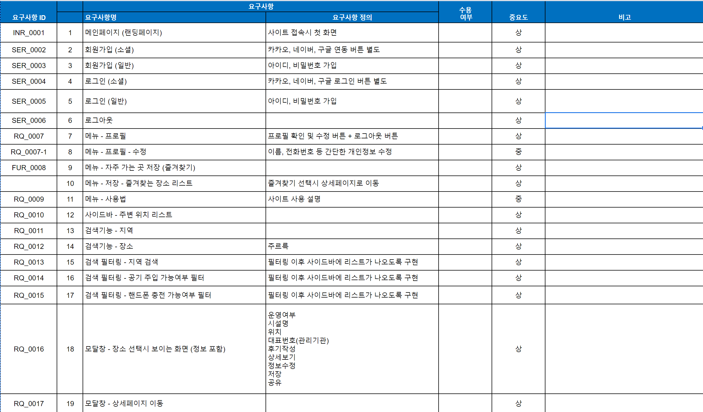
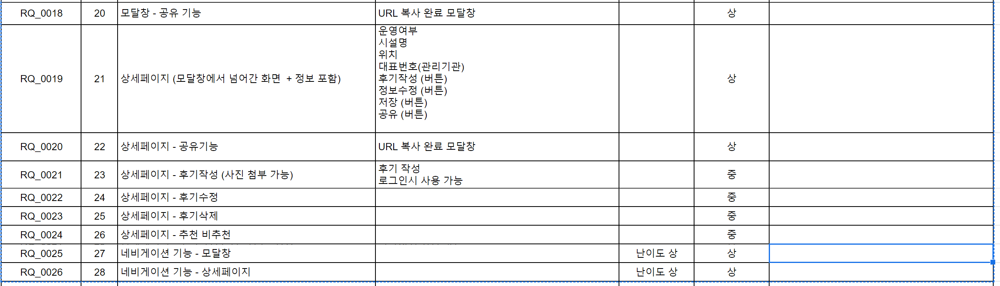

# Backend 계획서
> 아이디어만 있을 뿐 아직 명세서가 완성되지 않았습니다.
--- 

## 기능 요구사항 
> front-end의 

### 프로젝트 기한
* 기본 기능(게시판)으로 2주 안에 구현을 끝내는 것을 목표로 합니다.
* 9월 15일에(변경될 수 있음) 서버 배포를 먼저 시작합니다.
* 개발 기간은 데모데이 2주 전인 10/4 ~ 10/7일을 목표로 합니다. (정확한 날짜는 합의 필요) 이후 code freezing 
* 테스팅 기간은 10/14일에 끝내는 것을 목표로 합니다.
* 10월 17일에 통합테스트 18일에는 배포를 합니다.(수정 가능)

#### 요구사항 수정 

- 프런트 엔드와 협의하여 필수적인 기능을 먼저 구현하도록 요구사항을 수정하고 점진적인 개발을 할 수 있도록 합니다.
- 백엔드에 추가하기로 했던 스프링 시큐리티 기능을 쓰지 않을 것을 협의해야 함
- 임동근님의 AWS 책을 참고(?)해서 OAuth2 기능 개발 - 프런트엔드의 요구
- View가 아닌 Restful API가 되도록 협의 

### 현재 요구사항 명세서 진행상황(미완성)

- 

